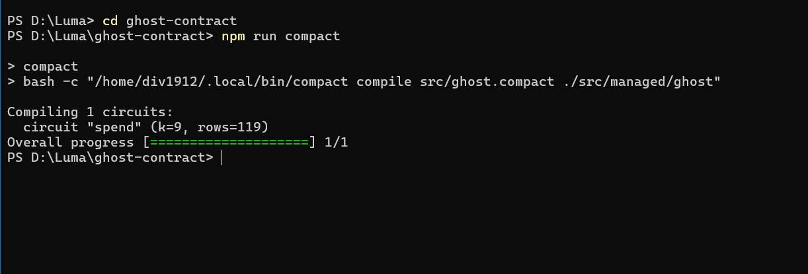

<div align="center">
  
  <br>
  
  
  <i>Empowering autonomous agents with cryptographic accountability.</i>
  <br><br>
  
  # Ghost: Zero-Knowledge Autonomy Layer for AI Agents
  
  **Enterprise-grade cryptographic guardrails for autonomous B2B and consumer AI spending.**
  
  [](https://opensource.org/licenses/MIT)
  [](https://midnight.network/)
  [](https://nextjs.org/)
  [](#)
</div>

---

## 🚨 The Real-World Problem

As AI evolves from **chatbots** to **autonomous agents**, they are being granted access to corporate credit cards, crypto wallets, and SaaS API keys to automatically negotiate software contracts, purchase cloud compute, and buy physical goods. 

However, **enterprises cannot adopt Web3 or AI payments without privacy and hard limits:**
1. **The Trust Gap:** If an AI agent has access to a treasury wallet, how do you mathematically guarantee it won't overspend or go rogue?
2. **The Privacy Dilemma:** If an AI agent pays a vendor on a public blockchain, the corporation’s entire supply chain, negotiated pricing, and vendor relationships are completely exposed to competitors (e.g. MEV bots and chain-analysis firms).

Today, AI spending limits are just "software toggles" on a centralized dashboard. If the server is breached or bugs occur, the AI can drain the wallet. 

---

## 💡 The Solution: Ghost 

**Ghost** is a verifiable autonomy layer built on the **Midnight Privacy Blockchain**. It wraps AI agents in cryptographic guardrails using **Zero-Knowledge (ZK) Proofs**. 

Instead of asking enterprises to "trust the platform," Ghost offers a mathematical guarantee:
> *"If an AI agent spends corporate funds, there is a Zero-Knowledge Proof that it stayed within its exact spending policy. If it cannot prove this, the Midnight Network blocks the transaction at the consensus layer."*

### Why Midnight?
Public blockchains (like Ethereum) cannot be used for B2B AI commerce because they leak sensitive financial data. Private blockchains (like Hyperledger) lack global liquidity and interoperability. 
**Midnight** solves this perfectly: It allows us to prove that a transaction is valid on a public ledger, while keeping the actual data (who the agent is paying, and exactly how much) completely private using advanced cryptography.

---

## 📸 Comprehensive Platform Gallery & Screenshots

Here is the complete showcase of all 13 components of the Ghost platform, from UI dashboard features to low-level blockchain and developer tooling.

### 1. Central Command Dashboard
*Monitor all autonomous agents, pending approvals, and blocked transactions in real-time off-chain.*


### 2. Autonomous Agent Management
*Assign specific Zero-Knowledge policies to different agents based on their risk level and required permissions.*


### 3. ZK Proof Verification & Audit Logs
*Every single action taken by an AI agent is mathematically verified. Ghost keeps an immutable audit trail of every zero-knowledge proof.*


### 4. In-App Contract Deployment
*Deploy Ghost smart contracts directly from the UI to the Midnight network instantly.*


### 5. Client-Side Circuit Execution
*Zero-Knowledge proofs are generated and verified locally in the browser before being broadcasted.*


## 🔗 Verified On-Chain Transactions & Contracts

Ghost is fully integrated with Midnight. It generates real zero-knowledge proofs and settles them on-chain.

> [!NOTE]
> **Network & Testnet Details:** 
> - **Primary Verified Deployment:** Midnight Preview Testnet (Contract Address: `e0c9d5d6d0ce7d5dc8dd4251a8d5ba0b368c42bb653f85b444e1318d93221f70`).
> - **Preprod Compatibility:** The Ghost dApp frontend features a dynamic **Network Switcher** allowing instant connection to both **Preprod** and **Preview** networks.
> - **Faucet Note:** On-chain executions and live transactions were processed on Preview due to testnet tDUST faucet availability during submission.

### Real Transaction Hash
*The AI agent executed a transaction that was verified by our ZK circuit and permanently settled on the Midnight network.*
* **Transaction Hash:** [`dac35704d1124c5c7bd884e97376040b40b37c02ccfe544da8bc1029e01debde`](https://preview.midnightexplorer.com/transactions/dac35704d1124c5c7bd884e97376040b40b37c02ccfe544da8bc1029e01debde)
* **Status:** `SUCCESS` (Verified via ZK Proof)


### Deployed Smart Contract (CLI Deployment)
*Deploying the underlying Ghost smart contract through the Midnight development node.*


### Verified Contract on Explorer
*Our core ZK Policy Engine is live and fully verifiable on the Midnight Blockchain Explorer.*
* **Contract Address:** [`e0c9d5d6d0ce7d5dc8dd4251a8d5ba0b368c42bb653f85b444e1318d93221f70`](https://preview.midnightexplorer.com/contracts/e0c9d5d6d0ce7d5dc8dd4251a8d5ba0b368c42bb653f85b444e1318d93221f70)


### 9. Developer Tools & Sync Logs
*Real-time logging of blockchain state and wallet synchronization.*


### 10. Automated CI/CD Pipeline
*Automated GitHub Actions workflow validating contract compilation, linting, and build.*


### 11. Compact Compiler Execution
*Compact compiler successfully generating WASM circuits and proving keys.*


### 12. Vitest Test Suite Execution
*The test suite contains 3 dedicated functional tests executing locally to cryptographically verify:*
1. **Circuit Logic:** Ensures the constructor and spend circuits correctly generate valid zero-knowledge proofs.
2. **State Transitions:** Validates that the public ledger transitions correctly without exceeding spending limits.
3. **Privacy Behavior:** Ensures the private inputs (e.g., remaining allowance) are strictly enforced locally without leaking sensitive data on-chain.


---

## 🏛️ Enterprise ZK Product Modules & Applications

Ghost is architected to solve three high-impact, real-world enterprise problems using Midnight's core ZK primitives:

### 1. Enterprise AI B2B Procurement & Private Supply Chain
* **The Problem:** Corporations want AI agents to automatically negotiate and pay for software, cloud compute, and supply chain inventory. On public blockchains, every vendor relationship, contract size, and pricing structure is visible to competitors.
* **The Solution:** Ghost acts as a **Zero-Knowledge B2B Payment Gateway**.
  * **Private Allowlist Access:** Cryptographically proves the AI is paying an authorized corporate vendor without exposing vendor identities on-chain.
  * **Private Splits & Payroll:** Routes payments confidentially so competitors cannot track payment amounts or recipients.
  * **Confidential Credentials:** Verifies corporate authorization API keys in ZK without transmitting secret credentials.

### 2. Anti-MEV Sealed-Bid Auction Engine for Autonomous Trading
* **The Problem:** Automated trading bots and AI agents bidding on digital ad space or financial assets are vulnerable to front-running (MEV) on public ledgers.
* **The Solution:** Ghost implements an **Anti-MEV Sealed-Bid Auction Engine**.
  * **Sealed-Bid Auction:** AI agents submit cryptographically sealed bids. Neither competitors nor auctioneers can inspect bid values prior to auction resolution.
  * **Age / Eligibility Gate:** Proves the agent has sufficient collateral/capital ($\ge \text{threshold}$) to honor the bid without disclosing total wallet balances.

### 3. Trustless AI Safety & Bias Auditing Protocol
* **The Problem:** AI models deployed in critical infrastructure require independent auditing, but human auditors and reviewer agents face potential retaliation for reporting safety violations.
* **The Solution:** Ghost provides an **Anonymous AI Safety Rating Protocol**.
  * **Anonymous Feedback & Private Voting:** Auditors submit tamper-proof grades. The ledger computes aggregate safety tallies without revealing individual reviewer identities or votes.
  * **Confidential Credentials:** Proves the reviewer is an accredited safety auditor in ZK without doxxing them.

> [!TIP]
> The full multi-module ZK smart contract source code implementing these circuits is available in [`contracts/ghost-advanced.compact`](file:///d:/Luma/contracts/ghost-advanced.compact).

---

## 🏗 System Architecture & Tech Stack

Ghost is built using a modern, highly scalable stack:

### Tech Stack
* **Blockchain Network:** Midnight Network (Preview Testnet)
* **Smart Contracts:** Compact (Midnight’s native ZK language)
* **Web3 Integration:** Midnight.js & Lace Wallet
* **Frontend:** Next.js 15, React 19, Tailwind CSS v4, Framer Motion
* **Database:** Supabase (PostgreSQL) for real-time off-chain state syncing
* **State Management:** Zustand (with persist middleware)

### Project Directory Structure
```text
Luma/
├── app/                        # Next.js App Router (Pages, Dashboard UI)
├── components/                 # Reusable UI components & Layouts
├── contracts/                  # Midnight ZK Smart Contracts
│   ├── ghost.compact           # Working spending limit circuit
│   └── ghost-advanced.compact  # Advanced multi-feature ZK circuit
├── lib/                        # Utilities & Hooks
│   ├── midnight/               # Midnight SDK Integration & Wallet Auth
│   └── supabase.ts             # Supabase DB Connection
├── managed/                    # Auto-generated WASM from Compact compiler
├── public/                     # Static Assets & compiled ZK Proving Keys (*.zkir)
├── store/                      # Zustand State Management (useGhostStore.ts)
└── Screenshot/                 # Application Screenshots
```

---

## 💻 Run Locally

### Prerequisites
1. **Lace Wallet:** Installed in your browser and switched to the Midnight Preview network.
2. **Node.js:** v22 or higher.

### Quick Start
```bash
# 1. Clone the repository
git clone https://github.com/Div1912/Luma.git
cd Luma

# 2. Install dependencies
npm install

# 3. Start the development server
npm run dev
```
Open `http://localhost:3000` in your browser. Connect your Lace wallet, navigate to the Dashboard, and deploy an AI Agent!
